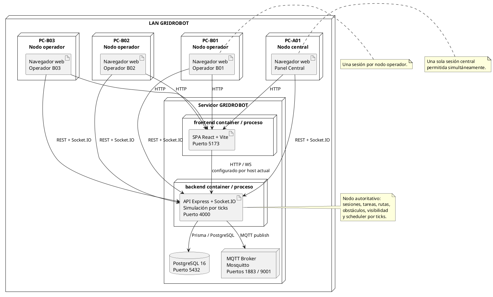

# Modelo de Despliegue de GRIDROBOT v1

## Introducción
GRIDROBOT se despliega como una solución distribuida ligera sobre red local, con clientes web basados en navegador, un backend Node.js/Express con Socket.IO, una base de datos PostgreSQL y un broker MQTT. El repositorio incluye además un `docker-compose.yml` que permite levantar PostgreSQL, MQTT, backend y frontend como contenedores diferenciados.

La arquitectura observable en la implementación actual responde a un patrón cliente-servidor con tiempo real, donde el backend constituye el nodo autoritativo de simulación y coordinación.

## Supuestos de modelado
- Se modela el despliegue esperado a partir de `docker-compose.yml`, `MANUAL_INSTALACION_LOCAL.md` y la configuración runtime del backend/frontend.
- La nomenclatura `PC-A01`, `PC-B01`, `PC-B02`, `PC-B03` se interpreta como nodos operativos lógicos; la GUI corre en navegador, no como binario dedicado por nodo.
- MQTT está presente y activo para publicación de obstáculos, aunque la interacción funcional principal con la GUI utiliza HTTP y Socket.IO.
- El despliegue prioritario es una LAN local o una misma máquina con exposición por IP local.

## Nodos del despliegue

### 1. Nodo central `PC-A01`
Rol:
- consola principal de supervisión,
- acceso de panel central,
- visualización global del mundo.

Artefacto cliente:
- navegador web apuntando al frontend Vite servido en el puerto configurado.

Conectividad:
- HTTP hacia frontend,
- HTTP REST hacia backend,
- Socket.IO/WebSocket hacia backend.

### 2. Nodos operadores `PC-B01`, `PC-B02`, `PC-B03`
Rol:
- puestos secundarios de operación,
- selección de tarea, robot compatible y preparación de viaje.

Artefacto cliente:
- navegador web consumiendo la misma SPA.

Conectividad:
- HTTP hacia frontend,
- HTTP REST hacia backend,
- Socket.IO/WebSocket hacia backend.

Observación:
- la restricción de unicidad por nodo se implementa en backend mediante `SessionAccessService`.

### 3. Nodo frontend
Implementación:
- aplicación React + Vite.

Función:
- servir interfaz de usuario,
- conectarse al backend por REST y Socket.IO.

Puerto observado:
- `5173` por defecto.

### 4. Nodo backend
Implementación:
- Node.js + Express + Socket.IO + Prisma + servicios de simulación.

Función:
- API REST,
- control de sesiones,
- simulación por ticks,
- gestión del estado del mundo,
- publicación MQTT de obstáculos,
- emisión de snapshots en tiempo real.

Puerto observado:
- `4000` por defecto.

### 5. Nodo base de datos PostgreSQL
Implementación:
- PostgreSQL 16.

Función:
- persistencia de nodos, robots, tareas, obstáculos, rutas, logs y métricas.

Puerto observado:
- `5432` por defecto, configurable.

### 6. Nodo broker MQTT
Implementación:
- Eclipse Mosquitto.

Función:
- intercambio de mensajería para tópicos del mundo, especialmente obstáculos.

Puertos observados:
- `1883` para MQTT,
- `9001` para WebSocket MQTT.

## Artefactos desplegados

| Nodo | Artefacto | Tecnología | Observaciones |
| --- | --- | --- | --- |
| `PC-A01` | Cliente web central | Navegador | Usa la SPA con rol central |
| `PC-B01/B02/B03` | Cliente web operador | Navegador | Usa la SPA con rol operador |
| `frontend` | Aplicación de presentación | React + Vite | Servidor de desarrollo en despliegue local actual |
| `backend` | API y simulador | Node.js + Express + Socket.IO + Prisma | Nodo autoritativo |
| `postgres` | Persistencia | PostgreSQL 16 | Estado de negocio y simulación |
| `mqtt` | Mensajería | Eclipse Mosquitto | Difusión de obstáculos y tópicos de mundo |

## Protocolos y comunicación

### Cliente <-> Frontend
- Protocolo: HTTP
- Finalidad: descarga de la SPA y recursos estáticos.

### Frontend <-> Backend REST
- Protocolo: HTTP/JSON con CORS habilitado.
- Endpoints observados:
  - `/api/sessions`
  - `/api/sessions/central/login`
  - `/api/sessions/operator/login`
  - `/api/sessions/logout`
  - `/api/sessions/release`
  - `/api/robots`
  - `/api/tasks`
  - `/api/tasks/:taskId/assign`
  - `/api/tasks/:taskId/start`
  - `/api/tasks/:taskId/cancel`
  - `/api/obstacles`

### Frontend <-> Backend tiempo real
- Protocolo: Socket.IO sobre WebSocket o transporte alternativo.
- Finalidad:
  - bootstrap del mundo,
  - snapshots por tick,
  - actualización de tareas,
  - actualización de rutas previas,
  - cambios de obstáculos,
  - errores de sesión y operación.

Eventos relevantes:
- `world:bootstrap`
- `world:snapshot`
- `task:updated`
- `tasks:list`
- `robot:updated`
- `obstacle:list`
- `preview:list`
- `gateway:error`

### Backend <-> PostgreSQL
- Protocolo: conexión PostgreSQL mediante Prisma.
- Finalidad:
  - persistencia y consulta del modelo de datos.

### Backend <-> MQTT Broker
- Protocolo: MQTT.
- Tópicos observados:
  - `gridrobot/world/obstacles`
  - `gridrobot/world/state`
  - `gridrobot/robots`

Uso efectivo observado:
- publicación de actualizaciones de obstáculos.

## Red local y despliegue esperado

El sistema está preparado para ejecutarse:
- en una sola máquina de desarrollo,
- o en una LAN donde varios navegadores acceden al mismo frontend/backend mediante la IP pública local configurada (`PUBLIC_HOST_IP`).

Supuesto operativo típico:
- una computadora central opera como `PC-A01`,
- varias computadoras secundarias o sesiones de navegador operan como `PC-B01`, `PC-B02` y `PC-B03`,
- todas comparten el mismo backend autoritativo y la misma base de datos.

La configuración de orígenes permitidos incluye por defecto:
- `http://localhost:<FRONTEND_PORT>`
- `http://127.0.0.1:<FRONTEND_PORT>`
- `http://<PUBLIC_HOST_IP>:<FRONTEND_PORT>`

## Dependencias de ejecución

| Dependencia | Propósito |
| --- | --- |
| Node.js 22 aprox. | ejecución de frontend y backend |
| npm workspaces | instalación coordinada del monorepo |
| PostgreSQL | persistencia |
| Prisma | acceso ORM y sincronización de esquema |
| MQTT broker | mensajería del mundo |
| Socket.IO | comunicación bidireccional tiempo real |
| Docker Compose | despliegue integrado opcional |

## Diagrama PlantUML

## Interpretación del despliegue
El despliegue actual de GRIDROBOT es coherente con una arquitectura centralizada de simulación con acceso distribuido por navegador. El backend concentra la lógica crítica y el estado autoritativo; PostgreSQL persiste el dominio; MQTT complementa la mensajería del mundo; y los clientes central y secundarios interactúan con el mismo sistema compartido desde la red local.

Desde el punto de vista operacional, esto permite:
- supervisión global desde el nodo central,
- operación distribuida desde nodos secundarios,
- consistencia de estado gracias a un único backend,
- y actualización continua mediante Socket.IO sin replicar lógica de negocio en los clientes.
