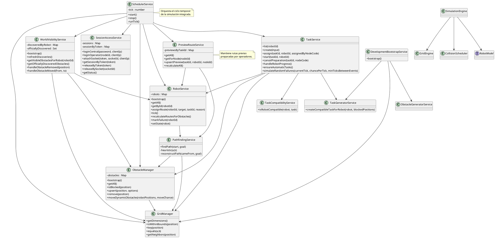

# Modelo de Clases de los Emuladores y Componentes de Simulación

## Introducción
GRIDROBOT implementa su lógica de simulación principalmente en el backend TypeScript y, de forma complementaria, en el paquete `packages/simulation-engine`, que expresa el dominio abstracto de simulación. En la aplicación actualmente ejecutable, la simulación real se articula en torno a servicios coordinados: gestión del grid, robots, obstáculos, cálculo de rutas, visibilidad del mundo, previsualización de rutas, tareas y un planificador por ticks.

El presente modelo no fuerza una traducción artificial a clases ajenas al código existente, sino que representa los módulos/clases efectivamente utilizados como componentes conceptuales de la emulación del mundo.

## Supuestos de modelado
- El flujo operacional efectivo del repositorio se implementa en `backend/src/modules/*`; por ello se prioriza ese conjunto frente al paquete genérico `packages/simulation-engine`.
- El paquete `simulation-engine` se interpreta como una formalización reusable del dominio, mientras que el backend contiene la integración viva con base de datos, sesiones y UI.
- `TaskService` participa del modelo de emulación porque decide transiciones de misión, fallos y reasignación durante la simulación por tick.

## Clases principales

### `GridManager`
Responsabilidad:
- Definir dimensiones del mundo.
- Validar límites del grid.
- Proporcionar vecindad ortogonal.
- Normalizar claves de coordenadas.

Relevancia en la simulación:
- Es el soporte espacial común para pathfinding, obstáculos, visibilidad y validaciones.

### `ObstacleManager`
Responsabilidad:
- Mantener el conjunto de obstáculos activos en memoria.
- Sincronizar obstáculos con PostgreSQL.
- Insertar, eliminar o reemplazar obstáculos.
- Simular desplazamiento de obstáculos dinámicos.
- Publicar cambios de obstáculos por MQTT.

Relevancia en la simulación:
- Es la fuente autoritativa de bloqueos dinámicos durante el cálculo de rutas.

### `PathfindingService`
Responsabilidad:
- Calcular rutas válidas entre dos posiciones mediante una estrategia A* simplificada con heurística Manhattan.
- Rechazar rutas fuera de límites o con destino bloqueado.

Relevancia en la simulación:
- Materializa la lógica de navegación sobre el grid.

### `RobotService`
Responsabilidad:
- Bootstrap del estado runtime de robots desde base de datos.
- Mantener `RobotState` en memoria.
- Asignar rutas a robots.
- Avanzar robots paso a paso en cada tick.
- Recalcular rutas ante cambios de obstáculos.
- Marcar fallos de robot y persistir cambios.
- Persistir rutas versionadas y estados.

Relevancia en la simulación:
- Es el emulador directo del movimiento de la flota.

### `TaskService`
Responsabilidad:
- Listar, crear, asignar e iniciar tareas.
- Resolver compatibilidad robot-tarea.
- Gestionar cancelación de preparación.
- Avanzar la lógica de la tarea según la posición alcanzada por el robot.
- Generar tareas automáticas compatibles.
- Simular fallos aleatorios y estados de asistencia.
- Construir vistas enriquecidas con ranking de robots.

Relevancia en la simulación:
- Coordina la lógica de misión y la relación entre movimiento físico y estado logístico.

### `TaskCompatibilityService`
Responsabilidad:
- Verificar si un robot satisface requisitos de capacidad, soporte, fragilidad o refrigeración de una tarea.

Relevancia en la simulación:
- Actúa como regla de negocio previa a la selección y reasignación.

### `TaskGeneratorService`
Responsabilidad:
- Generar tareas compatibles con robots concretos de forma determinista a partir de una semilla.
- Seleccionar origen, destino, prioridad y tipo de misión.

Relevancia en la simulación:
- Permite poblar el mundo con trabajo operativo sin intervención manual continua.

### `PreviewRouteService`
Responsabilidad:
- Mantener en memoria rutas previas por tarea.
- Recalcularlas cuando cambia el mundo.
- Asociarlas al nodo operador que reservó la tarea.

Relevancia en la simulación:
- Vincula la preparación humana del viaje con el estado geométrico del mundo.

### `WorldVisibilityService`
Responsabilidad:
- Gestionar descubrimiento de obstáculos por campo de visión alrededor de cada robot.
- Mantener distinción entre obstáculos oficialmente descubiertos y visibles por robot.
- Adaptar visibilidad cuando un obstáculo se mueve o desaparece.

Relevancia en la simulación:
- Introduce percepción parcial del entorno en lugar de omnisciencia absoluta para operadores.

### `SessionAccessService`
Responsabilidad:
- Gestionar bloqueo de sesiones central y por nodo.
- Reservar, adjuntar y liberar sesiones.
- Expirar reservas no conectadas.

Relevancia en la simulación:
- No altera el movimiento físico, pero sí el modelo de control distribuido sobre la simulación.

### `SchedulerService`
Responsabilidad:
- Ejecutar el bucle de ticks.
- Coordinar avance de robots, progreso de tareas, movimiento de obstáculos dinámicos, simulación de fallos y emisión de snapshots.

Relevancia en la simulación:
- Es el orquestador temporal del sistema.

### `DevelopmentBootstrapService`
Responsabilidad:
- Inicializar nodos, mapa, celdas, robots, tareas y obstáculos de arranque.

Relevancia en la simulación:
- Define el estado base desde el cual el emulador comienza a operar.

### `SimulationEngine` / `GridEngine` / `CollisionScheduler` / `RobotModel` del paquete `simulation-engine`
Responsabilidad:
- Proporcionar un modelo de simulación reusable más abstracto.

Interpretación:
- En la versión actual del sistema, estos componentes representan una capa de formalización técnica complementaria; el backend concentra el flujo integrado que efectivamente alimenta el producto.

## Relaciones

### Asociaciones estructurales
- `SchedulerService` depende de `RobotService`, `TaskService`, `ObstacleManager`, `WorldVisibilityService`, `PreviewRouteService`, `GridManager` y `SessionAccessService`.
- `RobotService` depende de `PathfindingService` y de Prisma.
- `PathfindingService` depende de `GridManager` y `ObstacleManager`.
- `ObstacleManager` depende de `GridManager`, Prisma y opcionalmente de un cliente MQTT.
- `TaskService` depende de `RobotService`, `GridManager`, `ObstacleManager`, `TaskCompatibilityService` y `TaskGeneratorService`.
- `PreviewRouteService` depende de `RobotService`, `PathfindingService` y Prisma.
- `WorldVisibilityService` depende de `GridManager`, `ObstacleManager` y `RobotService`.
- `DevelopmentBootstrapService` depende de `TaskGeneratorService` y `ObstacleGeneratorService`.

### Agregaciones conceptuales
- El `GridManager` agrega el conocimiento espacial mínimo del mundo.
- El `ObstacleManager` agrega la colección activa de obstáculos.
- El `RobotService` agrega los estados vivos de la flota.
- El `PreviewRouteService` agrega las rutas previas por tarea.
- El `SessionAccessService` agrega las sesiones activas por rol/nodo.

### Dependencias de control
- El avance temporal parte de `SchedulerService`.
- El movimiento real del robot se materializa en `RobotService.tick()`.
- Cuando un robot llega a origen o destino, `TaskService.handleRobotProgress()` actualiza la misión.
- Si cambian obstáculos, `RobotService.recalculateRoutesForObstacles()` y `PreviewRouteService.recalculateAll()` reaccionan.
- `WorldVisibilityService.refreshDiscoveries()` determina qué información puede mostrarse.

## Flujo resumido entre componentes
1. `DevelopmentBootstrapService` prepara mapa, nodos, robots, tareas y obstáculos iniciales.
2. `RobotService` y `ObstacleManager` cargan el estado runtime.
3. `SchedulerService` ejecuta ticks a la frecuencia configurada.
4. En cada tick, `RobotService` mueve robots y `TaskService` resuelve transiciones de tarea.
5. Si hay obstáculos dinámicos, `ObstacleManager` los desplaza y se fuerzan recalculados.
6. `WorldVisibilityService` actualiza descubrimientos.
7. `PreviewRouteService` mantiene consistencia de viajes preparados.
8. `socket-gateway` emite el estado resultante a clientes central y operadores.

## Diagrama PlantUML

## Breve interpretación del diagrama
El modelo revela una arquitectura de simulación por servicios especializados con coordinación centralizada. `GridManager` y `ObstacleManager` constituyen la base espacial; `PathfindingService` calcula trayectorias; `RobotService` ejecuta el movimiento; `TaskService` gobierna la lógica de misión; `WorldVisibilityService` controla la percepción parcial; y `SchedulerService` sincroniza todo ello por ticks.

Desde el punto de vista académico, se trata de un diseño modular con separación clara entre:
- modelo espacial,
- modelo de agentes móviles,
- modelo de misiones,
- modelo de percepción,
- y control temporal del simulador.
