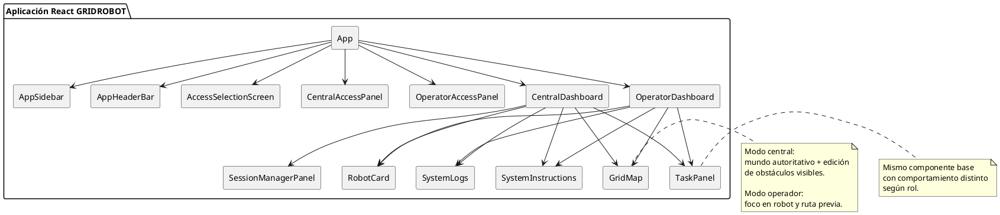
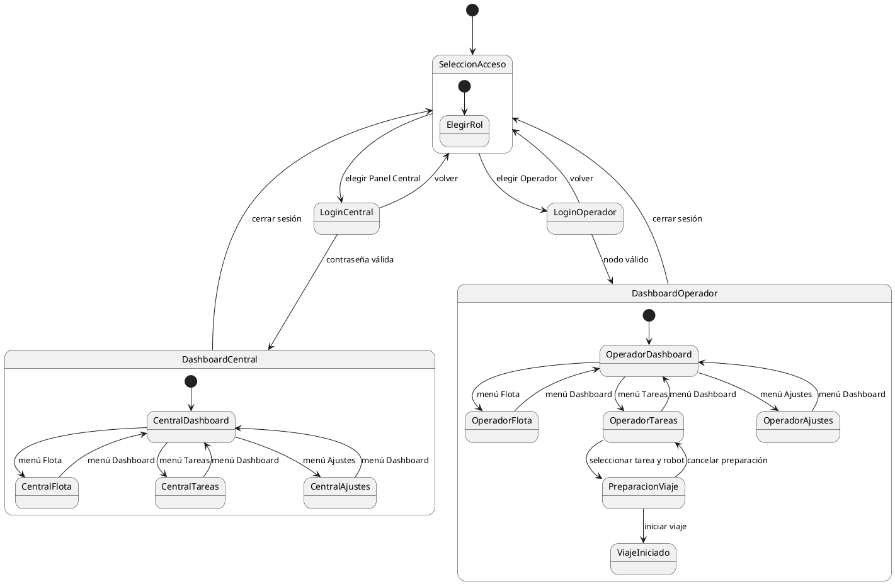

# Modelo de GUI de GRIDROBOT

## Introducción
La interfaz gráfica actual de GRIDROBOT está implementada en React y organiza la experiencia en torno a dos roles de uso: `panel central` y `operador secundario`. La aplicación no es una interfaz monolítica indiferenciada, sino una GUI adaptativa por rol, con un flujo inicial de selección de acceso y posteriormente con secciones comunes de navegación (`Dashboard`, `Flota`, `Tareas`, `Ajustes`).

La visualización principal combina:
- un mapa en cuadrícula de 40x25,
- paneles laterales de soporte,
- gestión de tareas,
- tarjetas de robot,
- administración de sesiones,
- y bitácora de eventos de cliente.

## Supuestos de modelado
- Se documenta la GUI implementada en `frontend/src`.
- Aunque la interfaz utiliza una única SPA, el comportamiento cambia significativamente por rol y debe modelarse como dos vistas operativas diferenciadas.
- Los textos visibles combinan etiquetas en español con algunos encabezados visuales en inglés; en este documento se normaliza la descripción en español.

## Roles de usuario

### Panel central
Responsabilidades observadas:
- Autenticarse mediante contraseña.
- Supervisar el mundo autoritativo completo.
- Visualizar toda la flota.
- Visualizar obstáculos descubiertos globalmente.
- Consultar y administrar sesiones activas.
- Agregar o retirar obstáculos desde el grid.
- Supervisar la evolución global de tareas.

Restricciones:
- Solo se permite una sesión central activa al mismo tiempo.

### Operador secundario
Responsabilidades observadas:
- Seleccionar un nodo fijo (`PC-B01`, `PC-B02`, `PC-B03`).
- Consultar tareas abiertas.
- Seleccionar una tarea.
- Elegir un robot compatible y disponible.
- Preparar el viaje.
- Iniciar manualmente el trayecto.
- Cancelar una preparación antes del inicio.

Restricciones:
- Solo se permite una sesión activa por nodo operador.
- La visibilidad del entorno puede depender del robot enfocado.
- El operador no dispone del control administrativo de sesiones.

## Pantallas principales

### 1. Pantalla de selección de acceso
Componente principal: `AccessSelectionScreen`

Propósito:
- Punto de entrada al sistema.
- Permite elegir entre acceso central y acceso operador.

Componentes:
- Encabezado principal del sistema.
- Métricas resumidas: número de sesión central y nodos secundarios.
- Tarjeta de acceso al panel central.
- Tarjeta de acceso a operador secundario.

Eventos de interacción:
- `Continuar como Panel Central`
- `Continuar como Operador Secundario`

### 2. Pantalla de acceso central
Componente principal: `CentralAccessPanel`

Propósito:
- Validar el acceso a la consola maestra.

Componentes:
- Hero descriptivo.
- Formulario con campo de contraseña.
- Mensajes de error o de bloqueo de sesión.
- Botones `Volver` y `Entrar al Panel Central`.

Eventos de interacción:
- Envío de contraseña.
- Cancelación y retorno a la selección inicial.

### 3. Pantalla de acceso operador
Componente principal: `OperatorAccessPanel`

Propósito:
- Seleccionar el nodo físico/lógico del operador y abrir su sesión.

Componentes:
- Hero descriptivo.
- Lista de nodos disponibles: `PC-B01`, `PC-B02`, `PC-B03`.
- Mensajes de error.
- Botones `Volver` y `Entrar como Operador`.

Eventos de interacción:
- Selección de nodo.
- Inicio de sesión por nodo.

### 4. Estructura principal autenticada
Componentes permanentes:
- `AppSidebar`
- `AppHeaderBar`
- contenedor dinámico de vista principal

Elementos de navegación:
- `Dashboard`
- `Flota`
- `Tareas`
- `Ajustes`

Información común:
- etiqueta de sesión actual,
- cambio de tema,
- cierre de sesión.

## Pantallas por sección

### Dashboard central
Vista principal: `CentralDashboard`

Componentes:
- cabecera de página,
- tarjetas estadísticas,
- `GridMap` en modo central,
- leyenda operativa,
- nota operativa.

Comportamiento:
- muestra la cuadrícula completa,
- resalta rutas previas,
- muestra obstáculos oficialmente descubiertos,
- permite clic sobre celdas para agregar o retirar obstáculos.

### Flota central
Vista principal: `CentralDashboard` sección `fleet`

Componentes:
- rejilla de `RobotCard`,
- panel de resumen de operación,
- panel de robot inspeccionado.

Comportamiento:
- permite seleccionar un robot para inspección detallada,
- expone métricas agregadas de unidades activas.

### Tareas central
Vista principal: `CentralDashboard` sección `tasks`

Componentes:
- panel lateral de estado de tareas,
- panel lateral de tipos de carga,
- `TaskPanel` en modo central.

Comportamiento:
- lista tareas no completadas,
- muestra estado textual de cada misión,
- presenta robots recomendados,
- el panel central observa pero no ejecuta el flujo de preparación manual como un operador.

### Ajustes central
Vista principal: `CentralDashboard` sección `settings`

Componentes:
- `SessionManagerPanel`,
- `SystemInstructions`,
- barra lateral de estado global,
- `SystemLogs`.

Comportamiento:
- actualiza la lista de sesiones,
- libera sesiones de operadores,
- ofrece soporte operativo e información del sistema.

### Dashboard operador
Vista principal: `OperatorDashboard`

Componentes:
- cabecera y métricas del puesto,
- `GridMap` en modo operador,
- leyenda reducida,
- `RobotCard` del robot elegido.

Comportamiento:
- muestra el robot enfocado,
- muestra previsualización de ruta,
- muestra obstáculos visibles según visibilidad disponible,
- orienta la preparación del viaje.

### Flota operador
Vista principal: `OperatorDashboard` sección `fleet`

Componentes:
- rejilla de `RobotCard`,
- resumen de disponibilidad,
- panel de robot elegido.

Comportamiento:
- permite elegir un robot antes o durante la preparación,
- filtra la decisión operativa del nodo.

### Tareas operador
Vista principal: `OperatorDashboard` sección `tasks`

Componentes:
- panel lateral de prioridad,
- panel lateral de tipos de carga,
- `TaskPanel` en modo operador.

Comportamiento:
- selección de tarea,
- selección de robot compatible disponible,
- acción `Iniciar viaje`,
- acción `Cancelar preparación`.

### Ajustes operador
Vista principal: `OperatorDashboard` sección `settings`

Componentes:
- `SystemInstructions`,
- `SystemLogs`.

Comportamiento:
- soporte contextual y seguimiento local de eventos de cliente.

## Componentes de la interfaz

### `GridMap`
Responsabilidad:
- representar el mundo 40x25,
- dibujar robots, rutas previas, obstáculos visibles, origen y destino,
- soportar densidad visual compacta o normal.

Entradas principales:
- dimensiones,
- robots,
- obstáculos,
- rutas previas,
- robot seleccionado,
- tarea destacada,
- modo central u operador.

### `TaskPanel`
Responsabilidad:
- listar tareas activas,
- mostrar prioridad, estado, origen, destino, requisitos y etapa,
- mostrar ranking de robots compatibles,
- habilitar acciones según rol y estado.

Comportamientos relevantes:
- En modo operador: permite reserva, inicio y cancelación.
- En modo central: ofrece una lectura supervisora del estado de misión.

### `RobotCard`
Responsabilidad:
- presentar identidad, estado y capacidades de un robot.

### `SessionManagerPanel`
Responsabilidad:
- listar sesión central y sesiones de operadores,
- refrescar estado,
- cerrar sesiones secundarias.

### `SystemLogs`
Responsabilidad:
- mostrar eventos locales derivados del estado del socket, cambios de tarea, cambios de robot y actualizaciones del mundo.

### `AppSidebar`
Responsabilidad:
- navegación global,
- marca del sistema,
- resumen de sesión actual.

### `AppHeaderBar`
Responsabilidad:
- mostrar título contextual,
- subtítulo por rol,
- control de tema,
- cierre de sesión.

## Flujo de navegación

### Flujo general
1. El usuario abre la SPA.
2. Selecciona modo de acceso.
3. Realiza autenticación central o selección de nodo operador.
4. Entra al contenedor principal autenticado.
5. Navega entre `Dashboard`, `Flota`, `Tareas` y `Ajustes`.

### Flujo operador de preparación de viaje
1. El operador accede con un nodo.
2. Selecciona una tarea activa.
3. La interfaz muestra robots compatibles y su disponibilidad.
4. El operador elige un robot.
5. El backend reserva la tarea y calcula una ruta previa.
6. La GUI muestra la previsualización.
7. El operador inicia el viaje o cancela la preparación.

### Flujo central de supervisión y administración
1. El usuario entra con contraseña.
2. Observa el dashboard global.
3. Revisa flota o tareas.
4. Puede modificar obstáculos visibles desde el grid.
5. En ajustes, consulta y libera sesiones secundarias.

## Diagrama PlantUML: modelo estructural de GUI

## Diagrama PlantUML: navegación e interacción

## Interpretación
La GUI de GRIDROBOT responde a una arquitectura orientada a rol y a operación. La misma aplicación React ofrece una experiencia centralizada para supervisión global y otra distribuida para operadores secundarios. El componente `TaskPanel` constituye el eje interactivo del flujo operacional, mientras que `GridMap` sirve como representación visual del estado del mundo y de las decisiones de viaje.

Desde una perspectiva de ingeniería de interfaces, el sistema combina:
- navegación lateral persistente,
- vistas tácticas por sección,
- componentes compartidos con semántica específica por rol,
- y actualización reactiva en tiempo real mediante WebSocket.
